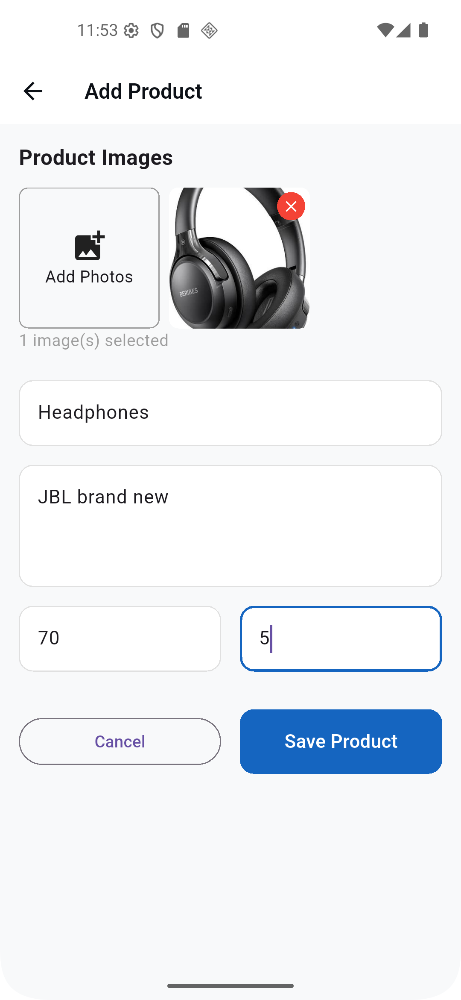

# 💳 Smart Checkout

<div align="center">


**Instagram-integrated mobile checkout solution for seamless e-commerce experience**

[Features](#-features) • [Screenshots](#-screenshots) • [Tech Stack](#-tech-stack)

</div>

---

## 📱 About

**Smart Checkout** is a modern mobile application designed for Instagram sellers to manage their product catalog and streamline the checkout process. Built with Flutter, it provides an intuitive dashboard for inventory management, order tracking, and business analytics.

## ✨ Features

- 📊 **Business Dashboard** - Real-time overview of orders, revenue, and products
- 🛍️ **Product Management** - Add, edit, and organize products with images and pricing
- 📦 **Inventory Tracking** - Monitor stock levels and product availability
- 💰 **Revenue Analytics** - Track sales performance with percentage growth indicators
- 🔐 **Secure Authentication** - Email/password login with "Remember Me" functionality
- 🔗 **Instagram Integration** - Designed specifically for Instagram sellers
- 📈 **Order Management** - Track pending orders and completed transactions
- 🎨 **Modern UI/UX** - Clean interface with smooth animations and Material Design
- 🔍 **Product Search** - Quickly find products in your catalog
- 📤 **Share Products** - Easy product sharing functionality

## 🎯 Tech Stack

- **Framework**: Flutter & Dart
- **UI Components**: Material Design 3
- **State Management**: Provider/Bloc pattern
- **Animations**: Custom Flutter animations
- **Platform**: Android & iOS support

## 📸 Screenshots

<div align="center">

| Dashboard | Login Screen |
|-----------|-------------|
|  |  |

| Add Product | Product Catalog |
|------------|-----------------|
|  |  |

</div>

## 🚀 Key Highlights

- **Instant Overview**: Dashboard displays total orders, revenue, products, and pending orders at a glance
- **Growth Metrics**: Track performance with percentage indicators (+12%, +8%)
- **Easy Product Addition**: Simple form with image upload, name, description, and pricing
- **Stock Management**: Real-time inventory tracking with color-coded stock status
- **Quick Actions**: Share products and manage product status (Active/Inactive)
- **Multi-Currency Support**: Built for Tunisian market (TND)
- **Responsive Design**: Optimized for various screen sizes

## 💡 What I Learned

- Building cross-platform mobile applications with Flutter
- Implementing smooth animations and transitions
- Creating intuitive dashboard interfaces with data visualization
- Managing state in complex mobile applications
- Designing user-friendly forms and input validation
- Working with image uploads and gallery integration

## 📝 Installation

```bash
# Clone the repository
git clone https://github.com/ayoub-rahmani/Smart_Checkout.git

# Navigate to project directory
cd Smart_Checkout

# Install dependencies
flutter pub get

# Run the app
flutter run
```

## 🔧 Requirements

- Flutter SDK 3.0+
- Dart 3.0+
- Android Studio / VS Code
- Android SDK / Xcode (for iOS)

## 📦 Key Features Breakdown

### Dashboard
- Welcome message with user name
- Quick access cards for Orders, Products, and Add Product
- Revenue and order statistics
- Growth percentage indicators
- Product count and pending orders tracking

### Product Management
- Image upload with gallery integration
- Product name and description fields
- Price and quantity inputs
- Active/Inactive status toggle
- Product search functionality
- Share product feature

### Authentication
- Email and password login
- Remember Me option
- Forgot Password recovery
- Sign Up for new users

## 👨‍💻 Developer

**Ayoub Rahmani**

- Portfolio: [ayoub-rahmani.github.io](https://ayoub-rahmani.github.io)
- LinkedIn: [ayoub-rahmani](https://www.linkedin.com/in/ayoub-rahmani-linkêdin)
- Email: ayoub.rahmani.dev@gmail.com

---

<div align="center">

⭐ Star this repository if you find it helpful!

</div>